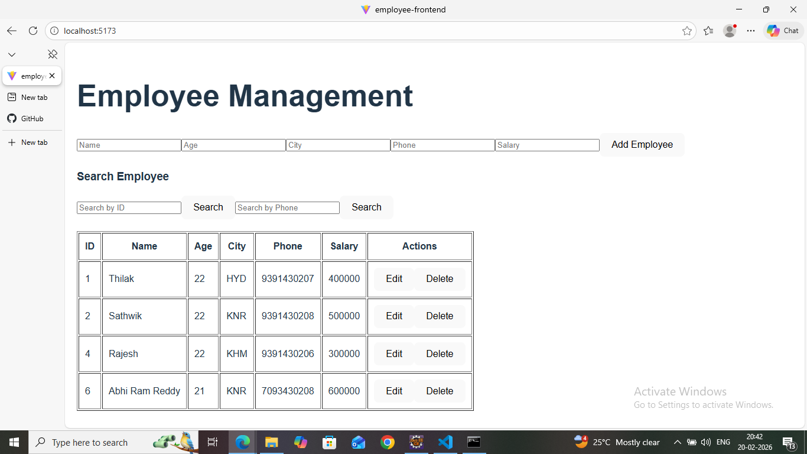
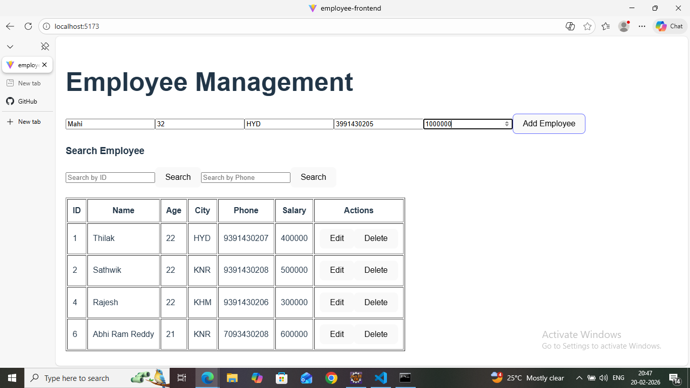
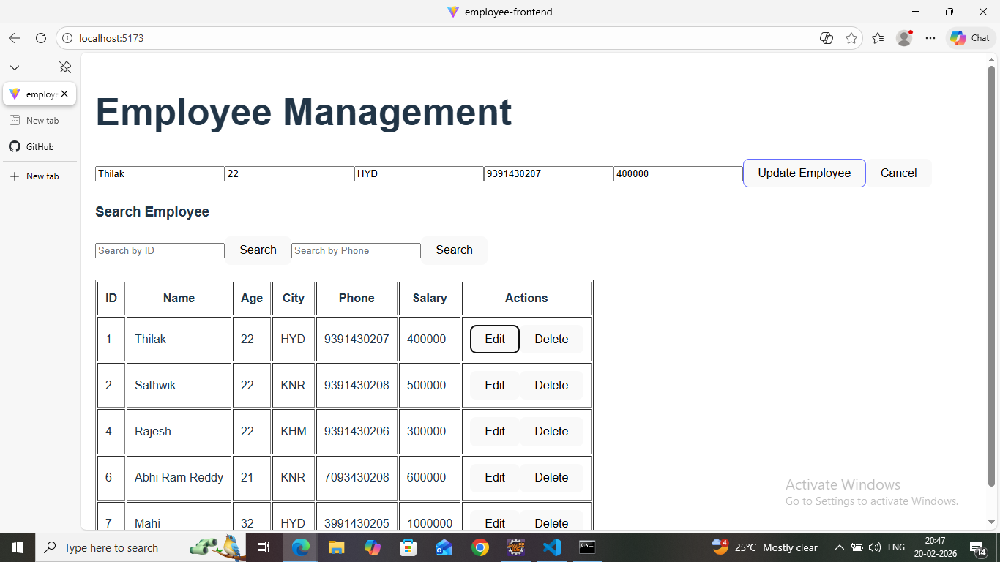

# 👨‍💼 Employee Management System

A simple and efficient **Employee Management System** that allows users to manage employee records using CRUD operations (Create, Read, Update, Delete).

This project demonstrates clean architecture, RESTful APIs, and database integration using a 3-tier client-server model.

---

## 🚀 Features

- ➕ Add New Employee  
- 📋 View All Employees  
- ✏️ Update Employee Details  
- ❌ Delete Employee  
- 🔍 Search Employees  
- 🗂️ Structured Project Architecture  

---

## 🧠 System Architecture

This application follows a **3-Tier Architecture (Client–Server Model)**:

```
                ┌────────────────────────┐
                │       Frontend         │
                │   (HTML / CSS / JS)    │
                └───────────┬────────────┘
                            │  HTTP Requests
                            ▼
                ┌────────────────────────┐
                │      Backend API       │
                │   (Node.js / Express)  │
                └───────────┬────────────┘
                            │  SQL Queries
                            ▼
                ┌────────────────────────┐
                │        Database        │
                │         (MySQL)        │
                └────────────────────────┘
```

### 🔹 Architecture Explanation

- **Frontend Layer:** Provides user interface to interact with the system.
- **Backend Layer:** Handles API requests, business logic, and server operations.
- **Database Layer:** Stores employee data securely and permanently.

---

## 🛠️ Tech Stack

- **Frontend:** HTML, CSS, JavaScript  
- **Backend:** Node.js / Express  
- **Database:** MySQL  
- **API Type:** RESTful API  

---

## 📂 Project Structure

```
employee-management-system/
│
├── backend/
│   ├── controllers/
│   ├── models/
│   ├── routes/
│   └── server.js
│
├── frontend/
│   ├── public/
│   └── src/
│
├── database/
│   └── schema.sql
│
├── screenshots/
│   ├── EmpManagement.png
│   ├── AddEmp.png
│   └── EditEmp.png
│
└── README.md
```

---

## 📸 Screenshots

Create a folder named **screenshots** in the root directory and add your images there.

### 🖥️ Dashboard


### ➕ Add Employee


### ✏️ Edit Employee


---

## ⚙️ Installation & Setup

### 1️⃣ Clone the Repository

```bash
git clone https://github.com/sathwik-chotu/employee-management-system.git
cd employee-management-system
```

### 2️⃣ Backend Setup

```bash
cd backend
npm install
npm start
```

### 3️⃣ Frontend Setup

```bash
cd frontend
npm install
npm start
```

### 4️⃣ Database Setup

1. Create a MySQL database.
2. Import the `schema.sql` file.
3. Update database credentials in backend configuration file.

---

## 📌 API Endpoints

| Method | Endpoint                | Description             |
|--------|-------------------------|-------------------------|
| GET    | /api/employees          | Get all employees       |
| GET    | /api/employees/:id      | Get employee by ID      |
| POST   | /api/employees          | Create new employee     |
| PUT    | /api/employees/:id      | Update employee         |
| DELETE | /api/employees/:id      | Delete employee         |

---

## 🧪 Future Improvements

- 🔐 Authentication & Authorization  
- 👥 Role-Based Access Control  
- 📄 Pagination  
- ☁️ Deployment Support  
- 📊 Dashboard Analytics  

---

## 🤝 Contributing

Contributions are welcome!  
Fork the repository and submit a pull request.

---

## 📄 License

This project is licensed under the MIT License.

---

## 👨‍💻 Author

**Sathwik Reddy**  
GitHub: https://github.com/sathwik-chotu
