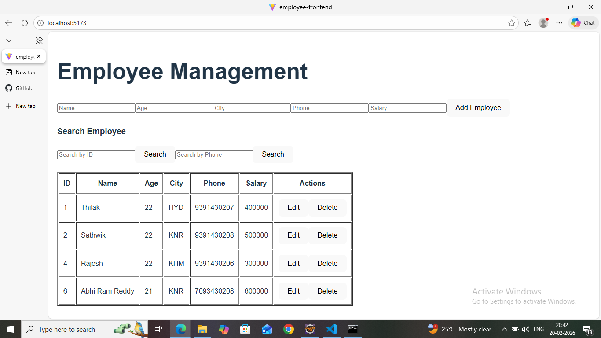
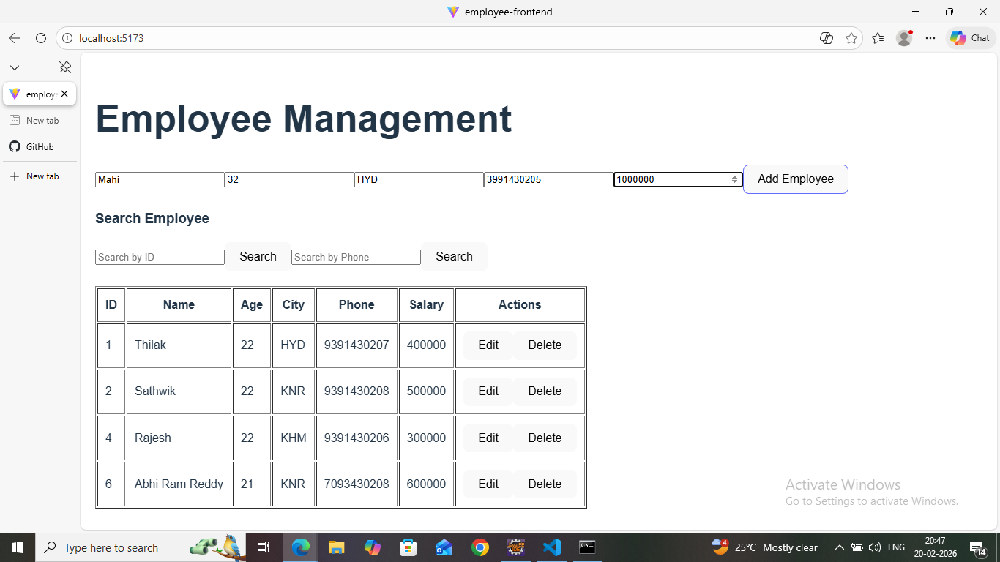
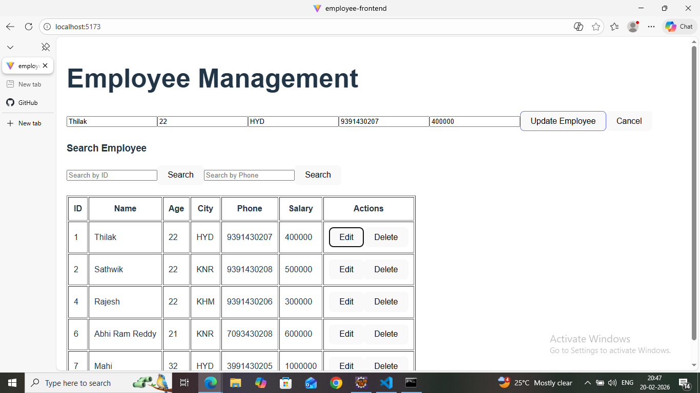

HEAD
# 👨‍💼 Employee Management System

A simple and efficient **Employee Management System** that allows users to manage employee records using CRUD operations (Create, Read, Update, Delete).

This project demonstrates clean architecture, RESTful APIs, and database integration using a 3-tier client-server model.


## 🚀 Features

- ➕ Add New Employee  
- 📋 View All Employees  
- ✏️ Update Employee Details  
- ❌ Delete Employee  
- 🔍 Search Employees  
- 🗂️ Structured Project Architecture  


## 🧠 System Architecture

This application follows a **3-Tier Architecture (Client–Server Model)**:

            ┌────────────────────────┐
            │       Frontend         │
            │   (React + Vite)       │
            └───────────┬────────────┘
                        |HTTP Requests(RESTAPI)
                        ▼
            ┌────────────────────────┐
            │      Backend API       │
            │   (Spring Boot)        │
            └───────────┬────────────┘
                        │  JPA / Hibernate
                        ▼
            ┌────────────────────────┐
            │        Database        │
            │         (MySQL)        │
            └────────────────────────┘

### 🔹 ┘

🔹 Architecture Explanation

Frontend Layer: Built using React (Vite) for a fast and interactive UI.
Backend Layer: Developed with Spring Boot to handle business logic and REST APIs.
Database Layer: MySQL database to store employee data securely.
Persistence Layer: Uses JPA (Hibernate) for database operations

---

## 🛠️ Tech Stack

- Frontend: React (Vite), HTML, CSS, JavaScript
- Backend: Spring Boot, Java
- Database: MySQL
- ORM: JPA (Hibernate)
- Build Tool: Maven
- API Type: RESTful API 

---

## 📂 Project Structure

```
employee-management-system/
│
├── backend/
│   ├── src/main/java/
│   │   ├── controller/
│   │   ├── service/
│   │   ├── repository/
│   │   └── model/
│   ├── src/main/resources/
│   │   └── application.properties
│   └── pom.xml
│
├── frontend/
│   ├── public/
│   └── src/
│       ├── components/
│       ├── pages/
│       └── App.jsx
│
├── database/
│   └── schema.sql
│
├── screenshots/
│   ├── dashboard.png
│   ├── add-employee.png
│   └── edit-employee.png
│
└── README.md


## 📸 Screenshots

Create a folder named **screenshots** in the root directory and add your images there.

### 🖥️ Dashboard


### ➕ Add Employee


### ✏️ Edit Employee



## ⚙️ Installation & Setup

### 1️⃣ Clone the Repository

   bash
git clone https://github.com/sathwik-chotu/employee-management-system.git
cd employee-management-system


### 2️⃣ Backend Setup (Spring Boot)

cd backend
mvn clean install
mvn spring-boot:run

### 3️⃣ Frontend Setup (React + Vite)

cd frontend
npm install
npm run dev
```


### 4️⃣ Database Setup

1. Create a MySQL database
Import the schema.sql file
Update database credentials in application.properties


## 📌 API Endpoints

| Method | Endpoint                | Description             |
|--------|-------------------------|-------------------------|
| GET    | /api/employees          | Get all employees       |
| GET    | /api/employees/:id      | Get employee by ID      |
| POST   | /api/employees          | Create new employee     |
| PUT    | /api/employees/:id      | Update employee         |
| DELETE | /api/employees/:id      | Delete employee         |


## 🧪 Future Improvements

- 🔐 Authentication & Authorization  
- 👥 Role-Based Access Control  
- 📄 Pagination  
- ☁️ Deployment Support  
- 📊 Dashboard Analytics  


## 🤝 Contributing

Contributions are welcome!  
Fork the repository and submit a pull request.


## 📄 License

This project is licensed under the MIT License.


## 👨‍💻 Author

**Sathwik Reddy**  
GitHub: https://github.com/sathwik-chotu

